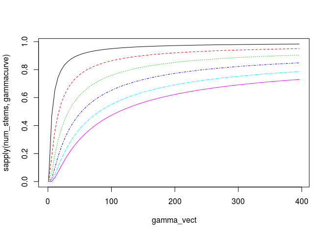

# Algebraic solution
Andrew MacDonald  
2014-10-30  

A reproduction of figure 2A in Kraft et al 2011


```r
###############################################################
## Algebraic solution for the beta partition: (i.e. fig 2A) ###
################################################################
# vector of regional gamma diversities
gamma_vect <- seq(1,400, by = 5)
# ncom is the number of transects per site
ncom <- 10
#stems per transect:
num_stems  <- c( 5, 15, 30, 50,  75, 100 )
gamma<-NULL
gamma_obs<-NULL
beta_obs_matrix<-matrix(0,length(num_stems), length(gamma_vect))
probs <- NULL
```


```r
for (j in 1:length(num_stems)) {
  beta_obs <- NULL
  for(i in 1:length(gamma_vect)){
    pool <- gamma_vect[i]
    quantile_vect <- seq(0,1,length.out = (pool +2))
    quantile_vect <- quantile_vect[2:(pool+1)]; #this will make evenly spaced draws from the lognormal species abundance distribution
    abundances <- qlnorm(quantile_vect)
    probs <- abundances/sum(abundances) #converts the abundance to probabilities
    prob_in_one_comm <- (1 - exp(num_stems[j]*log(1 - probs)))
    gamma_observed <- sum(1 - exp(num_stems[j]*ncom*log(1 - probs)))
    in_how_many = NULL
    for(k in 1:ncom) {
      in_how_many = rbind(dbinom(k,size = ncom, prob = prob_in_one_comm), in_how_many)
    }
    pi_vect <- apply(in_how_many, MARGIN = 1, FUN=sum)/ncom
    beta_partition <- (1 - sum(seq(ncom,1,by= -1)*pi_vect/gamma_observed))
    beta_obs <- c(beta_obs, beta_partition)
    gamma_obs<-c(gamma_obs, gamma_observed)
    gamma<-c(gamma, gamma_vect[i])
  }
  beta_obs_matrix[j,] <- beta_obs
}
plot(gamma_vect, beta_obs_matrix[1,], type = "l", ylim = c(0,1), xlim=c(0,300),xlab=expression(gamma-diversity), ylab=expression(beta -diversity), cex.lab=1.5, lwd=2, main="Algebraic solution")
for (m in 2:length(num_stems)) {
  points(gamma_vect, beta_obs_matrix[m,], type = "l", lwd=2)
}
```

 


I think this could be considerably simplified by breaking it into a few functions:


```r
## Given the size of a species pool, what are the lognormal probabilities of each species?

sp_prob_lnorm <- function(pool){
  quantile_vect <- seq(0,1,length.out = (pool +2))
  quantile_vect <- quantile_vect[2:(pool+1)]; #this will make evenly spaced draws from the lognormal species abundance distribution
  abundances <- qlnorm(quantile_vect)
  probs <- abundances/sum(abundances) #converts the abundance to probabilities
  probs
}


## Given a vector of species probabilities AND a local density AND the number of transects per community, what is the probability that a species occurs in a given community?
local_occur <- function(nstems, probs, .ncom = ncom){
  prob_in_one_comm <- (1 - exp(nstems * log(1 - probs)))
  in_how_many2 <- lapply(.ncom:1, function(x) dbinom(x, size = .ncom, prob = prob_in_one_comm))
  in_how_many <- do.call(rbind, in_how_many2)
  pi_vect <- rowSums(in_how_many)/ncom
  pi_vect
  }

## Given a vector of species probabilities AND a local density AND a number of transects per site, what is the observed gamma?
gammas <- function(nstems, probs, .ncom = ncom){
  gamma_observed <- sum(1 - exp(nstems * .ncom * log(1 - probs)))
  gamma_observed
  }
```

if you want you can combine these in a for loop:

```r
for (j in 1:length(num_stems)) {
  beta_obs <- NULL
  for(i in 1:length(gamma_vect)){
    allprobs <- sp_prob_lnorm(pool = gamma_vect[i])
    pi_vect <- local_occur(nstems = num_stems[j], probs = allprobs)
    gamma_observed <- gammas(num_stems[j], probs = allprobs)
    beta_partition <- (1 - sum((ncom:1)*pi_vect/gamma_observed))
    beta_obs <- c(beta_obs, beta_partition)
    gamma_obs<-c(gamma_obs, gamma_observed)
  }
  beta_obs_matrix[j,] <- beta_obs
}
plot(gamma_vect, beta_obs_matrix[1,], type = "l", ylim = c(0,1), xlim=c(0,300),xlab=expression(gamma-diversity), ylab=expression(beta -diversity), cex.lab=1.5, lwd=2, main="Algebraic solution")
for (m in 2:length(num_stems)) {
  points(gamma_vect, beta_obs_matrix[m,], type = "l", lwd=2)
}
```

 


or you can use a vectorized version. whatever is easier:

```r
## betapartition is calculated from both local occurrance number and observed gamma, AND the number of local samples:

betapart <- function(ngamma, loc.abd, .ncom = ncom){
    allprobs <- sp_prob_lnorm(pool = ngamma)
    pi_vect <- local_occur(nstems = loc.abd, probs = allprobs)
    gamma_observed <- gammas(num_stems[j], probs = allprobs)
    beta_partition <- 1 - sum((.ncom:1) * pi_vect / gamma_observed)
    beta_partition
}

gammacurve <- function(abd, .gamma_vec = gamma_vect){
  sapply(.gamma_vec, function(x) betapart(ngamma = x, loc.abd = abd))
}

matplot(gamma_vect, sapply(num_stems, gammacurve), type = 'l')
```

 

